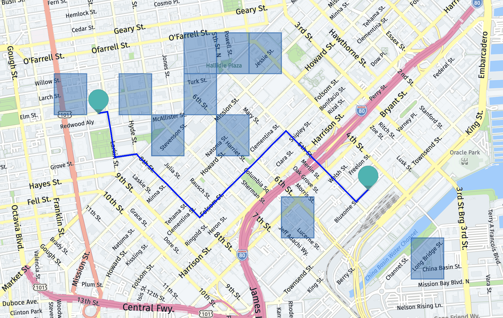

# NavSafe

## Problem
Anyone who has ever been in an unfamiliar city knows the feeling of apprehension that comes with navigating on foot from point to point. You want to walk to your destination efficiently, but are also mindful of the desire to stay safe. Without the embedded knowledge of being a local, you don’t know which streets to avoid, particularly in the evenings.

For certain populations such as women, this problem feels particularly acute.

Existing solutions do little to address this major issue:

- Conventional navigation apps like Google Maps don’t factor in pedestrian safety in their routing algorithms, often leading you through poorly lit alleyways to save on travel time
- Searching online on forums like Reddit is both time-consuming and confusing, as you can get conflicting information, and don’t have a great way to integrate that into your navigation plans
- Using online crime heat maps doesn’t give sufficient granularity - these tools often mark off entire neighborhoods, which isn’t useful.

## Solution
NavSafe uses historical crime statistics, data from safety surveys, and clustering models to generate an intelligence overview of dangerous areas in a city. 

Users simply has to enter: 
- Longitude & latitude of starting point
- Longitude & latitude of destination point
- Time of day (morning, afternoon, evening, or night)

Navsafe will then generate a route recommendation that is both efficient and safe. It also highlights risky areas in the map that are avoided.

  
 Click to view sample route 

## Running the Code

### Data Pipeline & Processing
In the 'pipeline.ipynb', the data is first pulled from the SF crime statistics using Socrata. The pulled database is stored as 'clean_data.csv'. 
The pulled database is then used as input for the notebook 'data_processing.ipynb' which is in charge of generating the 'alternative_classification_data_localized.csv' file. This last CSV file will serve as one of the input to the modeling notebooks. 

### Modeling
In this session, we will train the model on the final data generated from the data pipeline session. The following is a description of code functions for each part.

  
 Load Data 

Import the final crime report data generated from data pipeline and processing called 'alternative_classification_data_localized.csv', as well as the safety survey data that will be used, 'data_neighborhood_safety.csv'.

  
 Supervised - Logistic Regression 

  The previous attempt of using supervised learning. We won’t adapt this method for the final modeling.

  
 Unsupervised - Clustering 

  The current attempt of using unsupervised learning. It contains the tuning and training process for 3 clustering models, K-means, Agglomerative and Gaussian Mixed models.

  
 Map Visualization 

  In this part, we visualize the clustering results of all 6 models and one additional averaged clustering result in HERE API. 

  
 Test Set Comparison 

  We use the labeled test set data to evaluate all 7 clustering models and provide performance scores for them. This part contains 7 sub-sessions for each clustering method and one “compare results” sub-session to compare the scores and find good models among them. The labeled test dataset we used, 'data_testset.csv', has 128 records.

  
 Predict 

  Use the 7 clustering method to predict the dependent variable, avoid or not, for all records.

  
 Route Comparison 

  We test these 7 predictions on 2 sample routes to generate the required parameters that will be used in HERE API to find the safest route. Then we will add these parameters into HERE API HTML files to visualize the routes. We can assess these maps and eliminate results that are unhelpful.

  
 Conclusion 

  Analyze all the results and conclude that the best model is the agglomerative clustering model with 10 clusters, which we denote as 'agg, 10'.

### Web App (UI)

We used Flask to build the UI and embedded the HERE Routing API, which helps calculate the fastest pedestrian route between multiple points. The data used to calculate the areas to avoid is from the results of the model.

How to use the NavSafe Web application
1. Retrieve a free API key through a HERE Maps API account
2. Add API key to the ‘flaskr/templates/map_sf.html’ and ‘flaskr/templates/map_sf_route.html’ templates
3. Launch the NavSafe app by running the ‘navsafe_main.ipynb’ file

Here we are showing a user routing from the SF 4th & King St. Caltrain Station to Brenda’s Soul Food in the afternoon. The app will return a route that avoids nearby risky areas, which are marked with the red circles on the map.

## References 

Data Sources
- [San Francisco Police Department Incident Reports Data](https://data.sfgov.org/Public-Safety/Police-Department-Incident-Reports-2018-to-Present/wg3w-h783)
- [San Francisco City Survey Data](https://sfgov.org/sfc/citysurvey/about-city-survey)

Documentation
- [Clustering Model Evaluation and Results](https://docs.google.com/document/d/1JhnNBccKZihytR5tFnNlOQzxFtTyjfl8eINSViorPyQ/edit?usp=sharing)

HERE API Tutorials and Sample Code
- [Displaying an Interactive Map with Python and Flask](https://developer.here.com/blog/displaying-an-interactive-map-with-python-and-flask-part-2)
- [HERE Maps API Guide](https://developer.here.com/documentation/maps/3.1.22.1/dev_guide/topics/routing.html)

